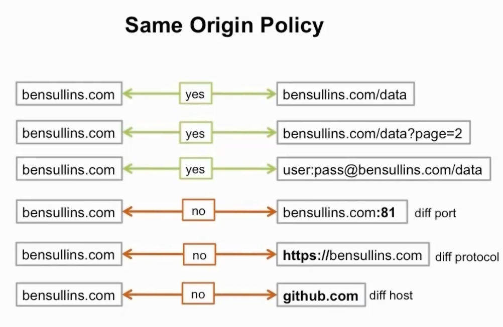

# d3-api-data-source

## Getting Data From Web APIs with D3

### `Step 1`

### `Notes`

Web APIs are generally also known as a REST APIs.

**REST API**
1. Send in a URL request for data
2. Sends back result
3. Parse Data

**Same Origin Policy**
* A policy built into web browsers and web servers
* When you try to access something thats external, you could be injecting or opening up your code for hacks and malicious attacks
* External: not hosted on your own domain or your own server

**About data.gov APIs**
* data.gov has simple and interesting datasets to use
* How to use: data.gov -> developer -> api -> API documentation